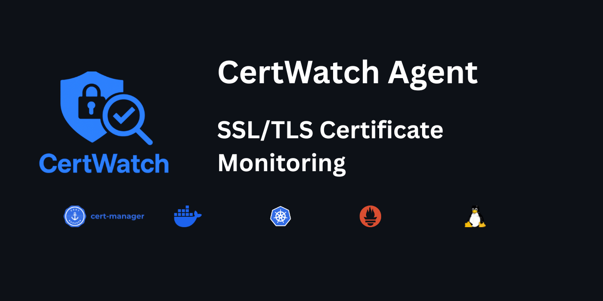
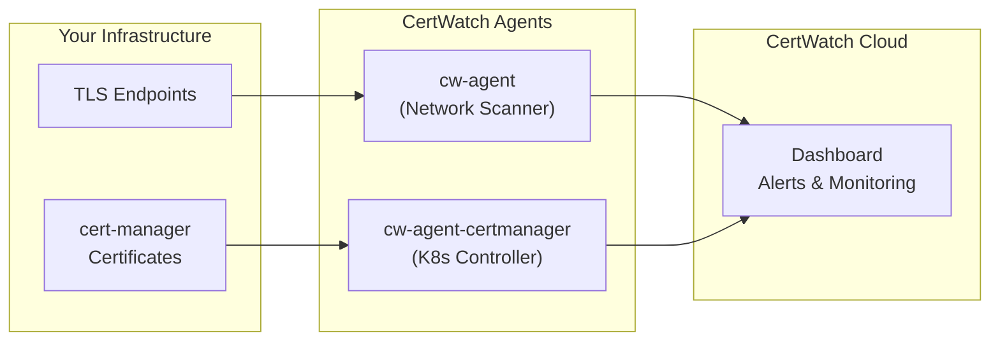

<p align="center">
  
</p>

<p align="center">
  <a href="https://github.com/certwatch-app/cw-agent/actions/workflows/ci.yml"></a>
  <a href="https://github.com/certwatch-app/cw-agent/actions/workflows/release.yml"></a>
  <a href="https://goreportcard.com/report/github.com/certwatch-app/cw-agent"></a>
  <a href="LICENSE"></a>
  <a href="https://artifacthub.io/packages/search?repo=cw-agent"></a>
</p>

<p align="center">
  <b>Monitor all your SSL/TLS certificates in one place.</b><br>
  CertWatch Agent syncs certificate data from your infrastructure to the <a href="https://certwatch.app">CertWatch</a> cloud dashboard for unified monitoring, alerting, and expiry tracking.
</p>

---

## Features

| Feature | Description |
|---------|-------------|
| **Network Scanning** | Monitor TLS certificates on any reachable endpoint |
| **cert-manager Integration** | Watch Kubernetes certificates managed by cert-manager |
| **Unified Dashboard** | See all certificates across clusters and environments |
| **Expiry Alerts** | Get notified before certificates expire |
| **Prometheus Metrics** | Export certificate metrics for monitoring |
| **Helm Charts** | Production-ready Kubernetes deployment |
| **Lightweight** | Single binary, minimal resources, secure defaults |

## Architecture



## Quick Start

### CLI (Linux/macOS)

```bash
# Install
curl -sSL https://certwatch.app/install.sh | bash

# Configure interactively
cw-agent init

# Start monitoring
cw-agent start -c certwatch.yaml
```

### Docker

```bash
docker run -v $(pwd)/certwatch.yaml:/etc/certwatch/certwatch.yaml \
  ghcr.io/certwatch-app/cw-agent:latest
```

### Kubernetes (Helm)

```bash
# Deploy both agents with shared API key
helm install certwatch oci://ghcr.io/certwatch-app/helm-charts/cw-stack \
  --namespace certwatch --create-namespace \
  --set global.apiKey.value=cw_your_api_key \
  --set agent.enabled=true \
  --set certManager.enabled=true \
  --set cw-agent.agent.name=network-scanner \
  --set cw-agent-certmanager.agent.name=k8s-cluster
```

See [Kubernetes Guide](docs/kubernetes.md) for production deployment instructions.

## Documentation

| Guide | Description |
|-------|-------------|
| [Getting Started](docs/getting-started.md) | Installation and basic setup |
| [CLI Reference](docs/cli-reference.md) | All commands and configuration options |
| [Docker Guide](docs/docker.md) | Container deployment with Docker Compose |
| [Linux Guide](docs/linux.md) | systemd service for local monitoring |
| [Kubernetes Guide](docs/kubernetes.md) | Helm deployment and GitOps |
| [cert-manager Integration](docs/cert-manager.md) | Monitor cert-manager certificates |
| [Metrics & Observability](docs/metrics.md) | Prometheus metrics and health endpoints |
| [Architecture](docs/architecture.md) | How CertWatch Agent works |

## Helm Charts

| Chart | Description | Documentation |
|-------|-------------|---------------|
| **cw-agent** | Network certificate scanner | [README](charts/cw-agent/README.md) |
| **cw-agent-certmanager** | cert-manager controller | [README](charts/cw-agent-certmanager/README.md) |
| **cw-stack** | Umbrella chart (deploy one or both) | [README](charts/cw-stack/README.md) |

Install from OCI registry:

```bash
# Individual charts
helm install cw-agent oci://ghcr.io/certwatch-app/helm-charts/cw-agent
helm install cw-agent-certmanager oci://ghcr.io/certwatch-app/helm-charts/cw-agent-certmanager

# Umbrella chart (recommended)
helm install certwatch oci://ghcr.io/certwatch-app/helm-charts/cw-stack
```

## Configuration

### Minimal Config

```yaml
api:
  key: "cw_your_api_key"

agent:
  name: "my-agent"

certificates:
  - hostname: "example.com"
```

### Full Config Reference

See [certwatch.example.yaml](certwatch.example.yaml) or the [CLI Reference](docs/cli-reference.md).

## Prometheus Metrics

| Metric | Description |
|--------|-------------|
| `certwatch_certificate_days_until_expiry` | Days until certificate expires |
| `certwatch_certificate_valid` | Certificate validity (1=valid) |
| `certwatch_scan_total` | Total scans by status |
| `certwatch_sync_total` | Total syncs by status |

See [Metrics Reference](docs/metrics.md) for the complete list and alerting examples.

## Running as a Service

### systemd

```ini
[Unit]
Description=CertWatch Agent
After=network.target

[Service]
Type=simple
User=certwatch
ExecStart=/usr/local/bin/cw-agent start -c /etc/certwatch/certwatch.yaml
Restart=always

[Install]
WantedBy=multi-user.target
```

### Docker Compose

```yaml
services:
  cw-agent:
    image: ghcr.io/certwatch-app/cw-agent:latest
    restart: unless-stopped
    volumes:
      - ./certwatch.yaml:/etc/certwatch/certwatch.yaml:ro
```

## Community

- [GitHub Discussions](https://github.com/certwatch-app/cw-agent/discussions) - Questions and ideas
- [Public Roadmap](https://certwatch.app/roadmap) - Vote on features
- [Documentation](https://docs.certwatch.app) - Full documentation
- [Report a Bug](https://github.com/certwatch-app/cw-agent/issues/new) - Found an issue?

## Changelog

### v0.5.0 (Current)

- **cert-manager integration** - New `cw-agent-certmanager` controller for monitoring Kubernetes certificates
- **cw-stack umbrella chart** - Deploy one or both agents with a single Helm release
- **Global API key support** - Share API key configuration across subcharts
- **PodDisruptionBudget** - High availability support for cert-manager controller
- **Documentation overhaul** - New docs/ folder with comprehensive guides

### v0.4.0

- **Helm chart** - Official Helm chart for Kubernetes deployments via OCI registry
- **Flexible API key config** - Support both inline `apiKey.value` and `apiKey.existingSecret`
- **Secure K8s defaults** - Non-root, read-only filesystem, dropped capabilities
- **GitOps ready** - ArgoCD and FluxCD examples included
- **Prometheus ServiceMonitor** - Optional ServiceMonitor for Prometheus Operator

### v0.3.0

- **Prometheus metrics** - Certificate, scan, sync, and agent metrics at `/metrics`
- **Health endpoints** - Kubernetes-ready `/healthz`, `/readyz`, `/livez`
- **Heartbeat support** - Agent offline detection and alerting

### v0.2.0

- **Interactive setup** - `cw-agent init` wizard for configuration
- **Agent state persistence** - Restart resilience and name change detection
- **Certificate migration** - Certificates transfer during agent reset

### v0.1.0

- Initial release

<details>
<summary><b>Full Changelog</b></summary>

### v0.4.0

- **Helm chart** - Official Helm chart for Kubernetes deployments via OCI registry
- **Flexible API key config** - Support both inline `apiKey.value` and `apiKey.existingSecret` for production
- **Secure K8s defaults** - Non-root, read-only filesystem, dropped capabilities
- **GitOps ready** - ArgoCD and FluxCD examples included
- **Prometheus ServiceMonitor** - Optional ServiceMonitor for Prometheus Operator users

### v0.3.0

- **Prometheus metrics** - Expose certificate, scan, sync, and agent metrics at `/metrics`
- **Health endpoints** - Kubernetes-ready `/healthz`, `/readyz`, `/livez` endpoints
- **Heartbeat support** - Configurable heartbeat interval for agent offline detection
- **Init wizard updates** - New "Observability" step for metrics port and heartbeat interval
- **Bug fixes** - Fixed Docker image tag, updated install script URL

### v0.2.1

- **Agent state persistence** - Agent ID stored in `.certwatch-state.json`
- **Name change detection** - Warns when `agent.name` changes in config
- **`--reset-agent` flag** - Reset state and migrate certificates to new agent
- **`--yes` flag** - Skip confirmation prompts for CI/automation
- **Unified CLI styling** - All commands now have consistent, polished output
- **Smart certificate migration** - Certificates transfer during agent reset

### v0.2.0

- **`cw-agent init` command** - Interactive configuration wizard
- **Non-interactive mode** - Create configs via environment variables
- **Beautiful forms** - Powered by charmbracelet/huh

### v0.1.0

- Initial release
- Certificate scanning and cloud sync
- `start`, `validate`, `version` commands
- Docker and systemd support

</details>

## Contributing

Contributions are welcome! Please read [CONTRIBUTING.md](CONTRIBUTING.md) for details.

## License

Apache 2.0 - see [LICENSE](LICENSE) for details.

## Third-Party Trademarks

The banner and documentation include logos of third-party projects for illustrative purposes:

- **Docker** and the Docker logo are trademarks of Docker, Inc.
- **Kubernetes** is a registered trademark of The Linux Foundation.
- **Prometheus** is a Cloud Native Computing Foundation project.
- **cert-manager** is a Cloud Native Computing Foundation project.
- **Tux** logo by Larry Ewing (lewing@isc.tamu.edu) using The GIMP.