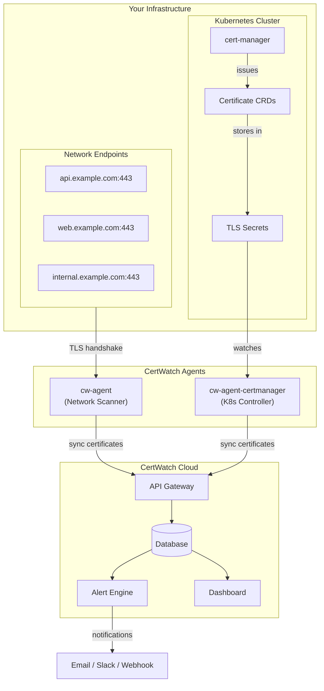
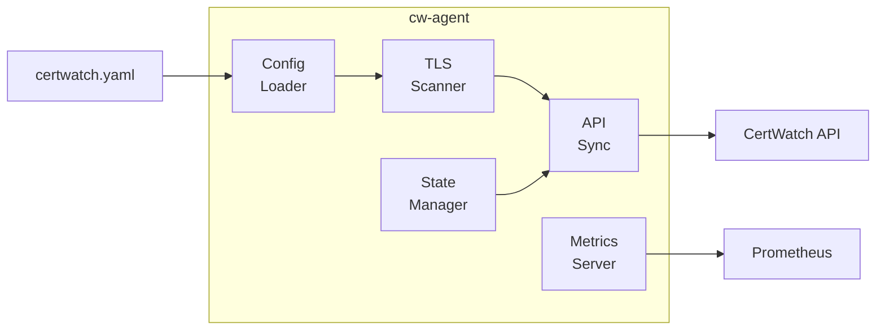
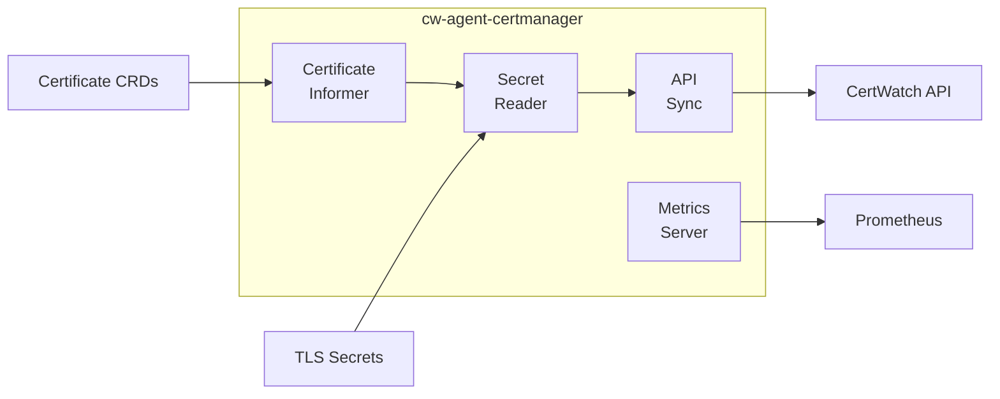
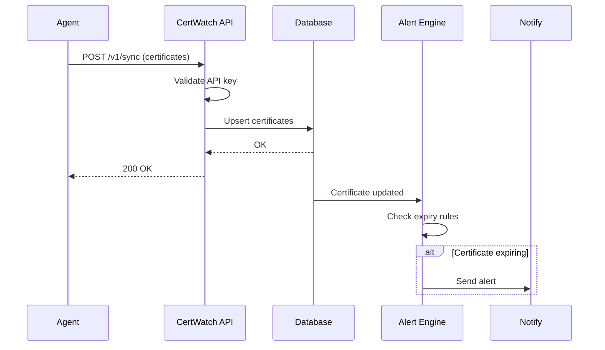
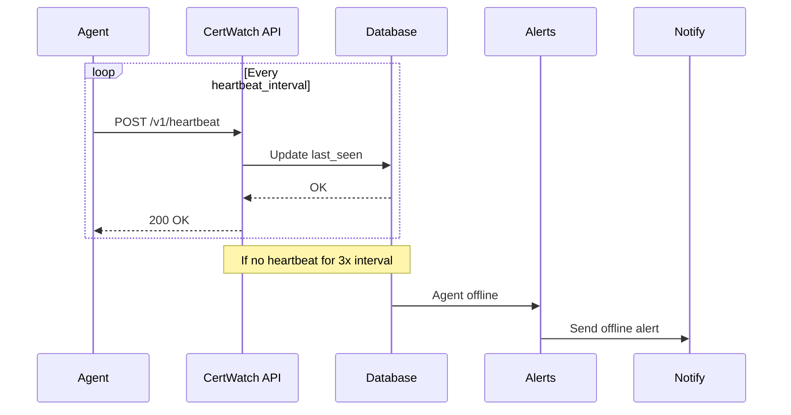

# Architecture

Overview of CertWatch Agent architecture and how components work together.

## System Overview



## Components

### cw-agent (Network Scanner)

The network scanner connects to TLS endpoints and extracts certificate information.

**How it works:**

1. **Configuration** - Reads list of hostnames/ports from config file
2. **Scanning** - Performs TLS handshake to each endpoint
3. **Extraction** - Parses certificate chain (subject, issuer, expiry, SANs)
4. **Validation** - Checks chain validity, expiration, weak crypto
5. **Syncing** - Sends certificate data to CertWatch API

**Architecture:**



**Key features:**

- Concurrent scanning (configurable concurrency)
- Automatic retry on transient failures
- Certificate chain validation
- State persistence for agent ID

### cw-agent-certmanager (Kubernetes Controller)

The cert-manager controller watches Kubernetes Certificate resources.

**How it works:**

1. **Watch** - Uses Kubernetes informers to watch Certificate CRDs
2. **Read Secrets** - Reads actual certificate data from TLS Secrets
3. **Extract** - Parses certificate details from Secret data
4. **Sync** - Sends certificate data to CertWatch API

**Architecture:**



**Key features:**

- Namespace filtering (all or specific namespaces)
- Real-time updates via informers
- RBAC-scoped access (read-only)
- Leader election for HA (planned)

### CertWatch Cloud

The cloud platform receives certificate data and provides monitoring.

**Components:**

| Component | Purpose |
|-----------|---------|
| API Gateway | Receives sync requests, authenticates agents |
| Database | Stores certificate data, agent state |
| Alert Engine | Evaluates expiry rules, sends notifications |
| Dashboard | Web UI for viewing certificates |

## Data Flow

### Certificate Sync Flow



### Heartbeat Flow



## Deployment Patterns

### Single Agent (CLI)

For monitoring external endpoints from a single location:

```
┌─────────────────┐         ┌─────────────────┐
│   Your Server   │         │ CertWatch Cloud │
│                 │         │                 │
│  ┌───────────┐  │  sync   │  ┌───────────┐  │
│  │ cw-agent  │──┼────────▶│  │    API    │  │
│  └───────────┘  │         │  └───────────┘  │
│                 │         │                 │
└─────────────────┘         └─────────────────┘
```

### Kubernetes (Helm)

For monitoring Kubernetes certificates and network endpoints:

```
┌─────────────────────────────────────────────────┐
│              Kubernetes Cluster                  │
│                                                  │
│  ┌─────────────┐      ┌─────────────────────┐   │
│  │  cw-agent   │      │cw-agent-certmanager │   │
│  │  (scanner)  │      │   (controller)      │   │
│  └──────┬──────┘      └──────────┬──────────┘   │
│         │                        │              │
└─────────┼────────────────────────┼──────────────┘
          │                        │
          │         sync           │
          └──────────┬─────────────┘
                     ▼
          ┌─────────────────┐
          │ CertWatch Cloud │
          └─────────────────┘
```

### Multi-Cluster

For monitoring multiple Kubernetes clusters:

```
┌─────────────────┐    ┌─────────────────┐    ┌─────────────────┐
│   Cluster A     │    │   Cluster B     │    │   Cluster C     │
│  (Production)   │    │   (Staging)     │    │  (Development)  │
│                 │    │                 │    │                 │
│ ┌─────────────┐ │    │ ┌─────────────┐ │    │ ┌─────────────┐ │
│ │certmanager  │ │    │ │certmanager  │ │    │ │certmanager  │ │
│ │agent: prod  │ │    │ │agent: stg   │ │    │ │agent: dev   │ │
│ └──────┬──────┘ │    │ └──────┬──────┘ │    │ └──────┬──────┘ │
└────────┼────────┘    └────────┼────────┘    └────────┼────────┘
         │                      │                      │
         └──────────────────────┼──────────────────────┘
                                ▼
                    ┌─────────────────────┐
                    │   CertWatch Cloud   │
                    │  (unified view)     │
                    └─────────────────────┘
```

## Security Model

### Agent Authentication

- API keys authenticate agents to CertWatch
- Keys scoped to `cloud:sync` permission
- Keys can be rotated without agent restart (planned)

### Network Security

- All communication over HTTPS
- Certificate pinning available (planned)
- Agent → Cloud only (no inbound connections)

### Kubernetes RBAC

The cert-manager controller uses minimal permissions:

```yaml
rules:
  - apiGroups: ["cert-manager.io"]
    resources: ["certificates", "certificaterequests", "issuers", "clusterissuers"]
    verbs: ["get", "list", "watch"]  # Read-only

  - apiGroups: [""]
    resources: ["secrets"]
    verbs: ["get", "list", "watch"]  # Read-only
```

### Container Security

Both agents run with security hardening:

```yaml
securityContext:
  runAsNonRoot: true
  readOnlyRootFilesystem: true
  allowPrivilegeEscalation: false
  capabilities:
    drop: [ALL]
```

## High Availability

### Network Scanner

- Run multiple replicas for redundancy
- Each replica scans all configured endpoints
- CertWatch deduplicates on sync

### cert-manager Controller

- Single replica recommended (leader election planned)
- PodDisruptionBudget for controlled upgrades
- Quick restart on failure (stateless design)

## Performance

### Resource Usage

| Component | CPU (idle) | CPU (active) | Memory |
|-----------|------------|--------------|--------|
| cw-agent | <1m | 10-50m | 32-64Mi |
| cw-agent-certmanager | <5m | 10-50m | 64-128Mi |

### Scaling Considerations

| Certificates | Recommended Config |
|--------------|-------------------|
| <100 | Default settings |
| 100-1000 | Increase sync_interval to 10m |
| >1000 | Contact support for enterprise options |